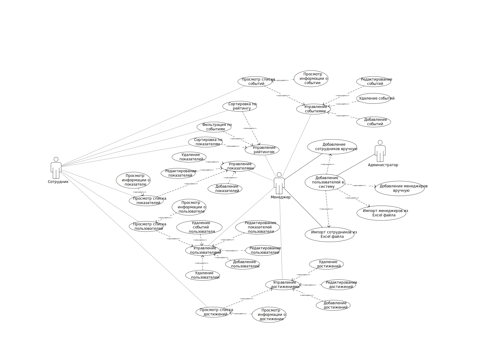

# 1. Перечень заинтересованных лиц:
* **Сотдрудник:** дополнительную моьтивацию к работе
* **Заказчик:** для улучшения произхводительности сотрудников компания
* **Менеджеры:** для улучшения произхводительности сотрудников отдела
# 2. Перечень функциональных требований:
1) B-1. Повышение мотивации сотрудников к работе
   - U-1.1 Получение достижений
       - F-1.1.1 Обновить показатель сотрудника
       - F-1.1.2 Отметить участие сотрудника в событии
       - F-1.1.3 Выдать сотруднику достижение
   - U-1.2 Ранжирование сотрудников
       - F-1.2.1 Обновление прогресса пользователя (полученных достижений)
       - F-1.2.2 Формирование рейтинга пользователей
       - F-1.2.3 Просмотр рейтинга пользователей администратором
       - F-1.2.4 Просмотр прогресса пользователя (лента)
       - F-1.2.5 Фильтрация и сортировка пользователей по показателям
 3) B-3. Сбор статистики
    - U-3.1 Возможность собрать статистику пользователя
      - F-3.1.1 Просмотр места в рейтинге
      - F-3.1.2 Просмотр прогресса выполненных достижений
      - F-3.1.3 Фильтрация достижений по параметрам

# 3. Диаграмма вариантов использования для функциональных требований:

# 4.Перечень нефункциональных требований:
1)	Приложение должно предоставлять интерфейс для сбора метрик.
2)	Приложение должно содержать в себе базовые метрики для оценки своей работы.
3)	Приложение должно быть stateless.
4)	Компоненты приложения должны быть минимально друг от друга зависимы.
5)	Приложение должно работать корректно и без отказов на абсолютно любых входных данных.
6)	Приложение должно поддерживать сборку в docker-контейнер.
7)	Приложение должно быть гибко конфигурируемым, то есть что можно и целесообразно вынести в конфиг – нужно вынести в конфиг.
8)	Обязательными полями в конфиге должны быть только значения, необходимые для запуска и работы приложения.
9)	Результат работы должен также включать в себя подробную инструкцию по конфигурированию приложения. 
