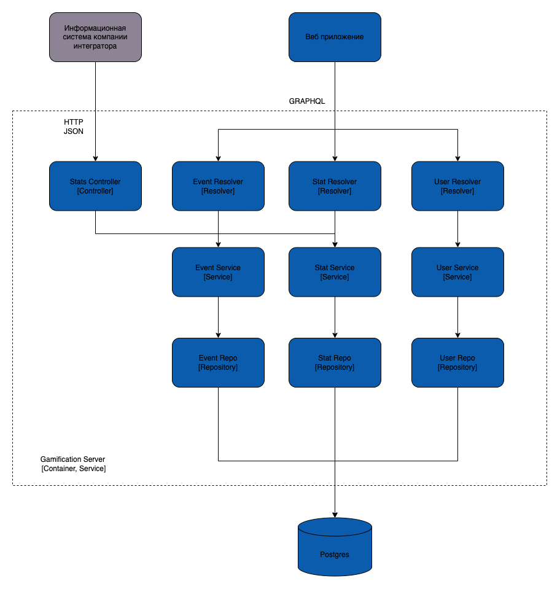
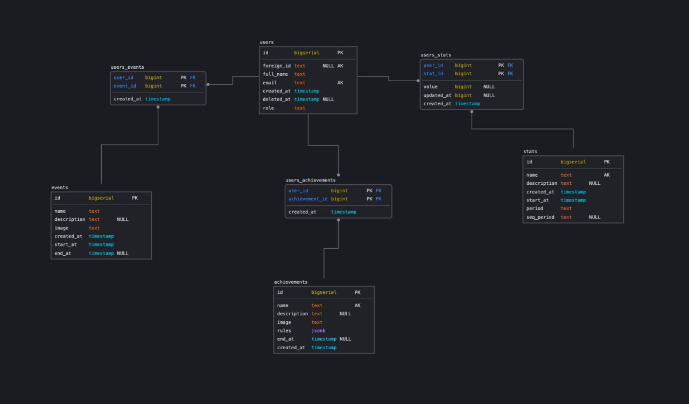

# Диаграмма компонентов



# Модель бд


# Клиентский и серверный код 
Клиент - https://github.com/Gamification-team-HSE/gamification-frontend

Сервер - https://github.com/Gamification-team-HSE/gamification-backend

# Пояснение за практики

- KISS (Keep It Simple, Stupid): 
- YAGNI (You Ain't Gonna Need It): Мы добавляем только те функции, которые действительно необходимы для текущего функционала.
Для выявления неиспользуемых кусков кода используем golang-ci линтер в CI/CD
- DRY (Don't Repeat Yourself): Код организован и поделен так, что его можно переиспользовать, избегая самокопирования.
Например код сервиса картинок имплементирует метод валидации, который используется несколько раз в разных местах
  https://github.com/Gamification-team-HSE/gamification-backend/blob/95c47419754eb793af49f936af62b5704fd1425e/internal/services/image/service.go#L39
```go
func (s *service) Validate(ctx context.Context, imageType Type, image *graphql.Upload) error {
	validationRules, ok := s.validationMap[imageType]
	if !ok {
		return fmt.Errorf("invalid image type")
	}
	if image.Size > validationRules.MaxSize {
		return fmt.Errorf("image to large")
	}
	if !contains(validationRules.ContentTypes, image.ContentType) {
		return fmt.Errorf("wrong content type")
	}
	return nil
}
```
- SOLID - для начала стоит отметить, что речь тут пойдет о языке GO и для него не все принципы солида применимы напрямую
  - S - в языке GO под принципом единой ответсвенности обычно подразумевают хороший нейминг пакетов. 
  Подобное фокусирование на именовании не просто педантичность. Плохо именованные пакеты упускают возможность описать свою задачу, даже если бы она у них была.
  Я думаю что пакеты Go воплощают дух философии UNIX. В действительности каждый пакет Go сам по себе - это маленькая Go
  программа, единственная точка изменений с единственной ответственностью.
  - O - GO реализует принцип открытости для расширения и закрытости для модификации на уровне типов, то есть язык устроен так, что по дефолту реализует данный принцип
  - L - Вместо этого подстановка, это компетенция интерфейсов в Go. В Go от типов не требуют имплементации конкретного интерфейса,
  вместо этого любой тип имплементирующий интерфейс просто содержит метод чья сигнатура соответствует декларации интерфейса. 
  Мы говорим, что в Go интерфейсы удовлетворяются неявно вместо явного соответствия и это оказывает глубокое влияние на то, как они используются в языке.
  Хорошо продуманный интерфейс, это скорее всего маленький интерфейс; преобладающая идиома это то, что интерфейс содержит только единственный метод. 
  Вполне логично, что маленький интерфейс содержит простую имплементацию, поскольку сложно сделать иначе. Из чего следует, что пакеты -это компромисное решение простых 
  имплементаций связанных обычным поведением. Соответсвеннно, у нас весь код построен вокруг использования небольших интерфейсов.
  Пример - https://github.com/Gamification-team-HSE/gamification-backend/blob/95c47419754eb793af49f936af62b5704fd1425e/internal/repositories/cache/auth/repository.go
  - I - В GO принцип разделения интерфейса решается тем, что в функции мы можем передавать интерфейсы, которые обобщают и ограничивают поведение структур, которые мы можем в эту функцию передать.
  Пример (создание сервиса, в качестве аругментов передаются интерфейсы репозиториев) - https://github.com/Gamification-team-HSE/gamification-backend/blob/95c47419754eb793af49f936af62b5704fd1425e/internal/services/event/service.go#L230
  - D - Принцип инверсии зависимостей, при соблюдении четырех предыдущих принципов, в GO этот принцип выполняется автоматически. 
  В Go ваш граф импортов должен быть ацикличным. Попытка игнорирования ацикличности приведет к ошибке компиляции, 
  но гораздо более серьезная ошибка может быть в архитектуре. При прочих равных условиях граф импорта хорошо разработанной Go
  программы должен быть широким и относительно плоским вместо того, чтобы быть высоким и узким. Если у вас есть пакет, 
  функции которого не могут исполняться без привлечения помощи другого пакета, возможно это сигнал о том, что не достаточно 
  хорошо определены границы пакета.

## Дополнительные принципы разработки

### BDUF (Big Design Up Front)

Масштабное проектирование прежде всего

В нашем проекте мы приняли решение отказаться, потому что требования менялись под заказчика в процессе разработки системы и принцип бы принес избыточность по времени, поэтому приняли решение двигаться итеративно.

### SoC (Separation of Concerns)

Принцип разделения ответственности

В разработке на Vue.js + Go разделение ответственности по умолчанию рекомендовано при написании бизнес-логики продукта, в данном проекте также были разделены зоны ответственности между различными модулями, отвечающими за свои небольшие зоны (например - модуль авторизации во фронтенде отделен от модуля всех пользователей).

### MVP (Minimum Viable Product)

Минимально жизнеспособный продукт

Проект развивался итеративно и в качестве одного из этапов был создан MVP с минимальным набором функций и несложным интерфейсом для авторизации и создания/изменения показателей и достижений, а в последствии продукт был дополнен функционалом событий, улучшенным интерфейсом и конструктором условий для событий и достижений.

### PoC (Proof of Concept)

Доказательство концепции

Для ускорения разработки и упрощения взаимодействия контейнеров бэкенда и фронтенда в момент выбора технологий был предложен GraphQL и проведен эксперимент по запуску с ним системы авторизации - он оказался успешным и технология была использована в дальнейшем вместо REST API, который планировался по умолчанию в начале проекта.